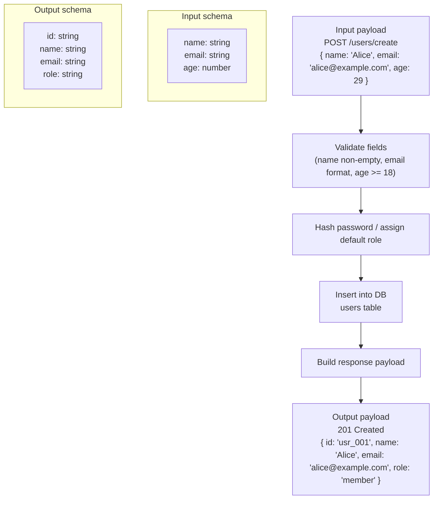

# Codebase Doc Mapper

Converts a source codebase into a **parallel Markdown knowledge base**: one `.md`
file per source file, same folder structure, written in the user's chosen
language, with clickable links (Obsidian `[[wikilink]]` style) between files
that import/depend on each other, plus dedicated explainer pages for external
libraries. This lets the user open the output folder in Obsidian and navigate
a whole codebase by clicking through dependencies instead of reading file by
file.

## Step 1 — Collect required inputs

Before doing any work, Claude MUST have all four of these. If any are
missing, ask the user directly (a single grouped question is fine) — do not
guess or default silently:

1. **Source path** — the folder or specific file to document.
2. **Output location** — a *different* folder from the source where the
   mirrored `.md` structure will be written (never write `.md` files
   next to the original source files, and never write into the source
   tree itself).
3. **Explanation language** — English, Sinhala (සිංහල), or German (Deutsch).
   If the user names another language, that's fine too — just confirm it
   explicitly rather than assuming.
4. (Implicit) Confirm the output folder doesn't already exist with unrelated
   content, or ask before overwriting.

Do not proceed to Step 2 until all of these are known.

## Step 2 — Inventory the codebase

1. Use `view` on the source path to get the full directory tree.
2. Identify every source code file to document (skip build artifacts,
   `node_modules`, `vendor`, `.git`, lockfiles, binaries, generated code —
   use judgment per language; ask the user if unsure whether a large
   generated-looking directory should be included).
3. For each source file, read it and identify:
   - Its core purpose / responsibility
   - Its main functions, types, classes, structs, or exported symbols
   - Its **internal imports** (other files in the same codebase)
   - Its **external imports** (third-party libraries / stdlib packages)

For a large codebase, work through directories in batches rather than
reading every file into context at once — process a directory, write its
`.md` files, then move to the next.

## Step 3 — Plan the link graph before writing

Because Markdown links must point to files that exist (or will exist),
build a mental (or literal, in a scratch file) map first:

- One entry per source file → its future `.md` path (mirrors source path,
  same relative structure, under the output folder, extension changed to
  `.md`).
- One entry per **distinct external library** encountered anywhere in the
  codebase → a single shared explainer page for that library (do not
  duplicate a library page per file that imports it — link to the same
  shared page from everywhere it's used).

Recommended output layout:

```
<output_location>/
├── <mirrored source tree, .md files>/
│   └── ...
└── _libraries/
    ├── <library-name>.md      (one per distinct external dependency)
    └── ...
```

## Step 4 — Write one Markdown file per source file

For every source file, create the corresponding `.md` file with this
shape (translate all prose into the requested language — headings can stay
close to these labels but should read naturally in that language):

```markdown
# <original filename>

**Path:** `<original relative path>`

## What this file does
<Plain-language explanation of the file's core responsibility and logic,
written in the requested language, at a level a developer unfamiliar with
this codebase — but not with programming — can follow. Explain the "why"
and the flow, not just a line-by-line restatement.>

## Key functions / types
- `<name>` — <what it does, in the target language>
- ...

## Imports
- Internal: [[<linked-file-name>]] — <one-line reason this is used>
- External: [[_libraries/<library-name>]] — <one-line reason this is used>

## Diagram
```mermaid
<A diagram appropriate to the file's content — see Step 6>
```
```

Rules:
- **Exactly one `.md` file per source file, always** — even if the source
  file is very large, do not split it into multiple `.md` files. Summarize
  at a level of detail appropriate to the file's size, but keep it one file.
- Use Obsidian wikilink syntax `[[target-file-without-extension]]` for
  cross-links (Obsidian resolves these by filename across the vault, so
  keep filenames unique or use relative paths inside the brackets if
  collisions are possible, e.g. `[[folder/file]]`).
- Never invent imports or symbols that aren't actually in the source file.

## Step 5 — Write one explainer page per external library

For each distinct external/third-party import found anywhere in the
codebase, create a single page at `_libraries/<library-name>.md`:

```markdown
# <library name>

## What it is
<Brief description of the library/package — what problem it solves.>

## Key features used in this codebase
<Only describe what's actually relevant/used here, not the whole library's
API surface, unless the user asks for a full reference.>

## Used by
- [[<file that imports it>]]
- [[<another file that imports it>]]
...
```

Populate "Used by" by cross-referencing back to every source file's `.md`
page that imports this library, so navigation works both directions.

If Claude doesn't already know a library well, a quick web search for its
purpose is appropriate — keep the description short and factual, in
Claude's own words per standard citation/copyright rules.

## Step 6 — Use Mermaid diagrams liberally

Include a Mermaid diagram in most files wherever it clarifies something —
prefer showing structure over describing it in prose. Common cases:

- **Per-file dependency diagram**: this file's internal + external imports
  as a simple graph.
  ```mermaid
  graph LR
    thisFile[this_file.go] --> dep1[other_file.go]
    thisFile --> lib1[gin]
  ```
- **Per-file control/data flow**: for files with non-trivial logic (a
  handler, a pipeline, a state machine), a flowchart of the main logic path.
- **Top-level architecture diagram**: also generate one root `_overview.md`
  in the output folder with a single Mermaid graph of the whole codebase's
  module/package relationships, plus a short written summary of the
  project's overall architecture in the target language. Link every node
  to its corresponding `.md` file.

Keep diagrams readable — for very large fan-out, show the most important
relationships rather than every single edge, and say so in the surrounding
text.

### API functions: add an example data-flow diagram

For any function that is API-related (an HTTP handler, route function,
RPC endpoint, controller action, request/response processor, etc.),
include an **additional** diagram beyond the structural dependency graph:
a concrete, made-up-but-realistic example showing input → processing →
output, with actual example values, not just types.

This means:
- **Input parameters**: a sample request — the actual parameter names and
  example values (e.g. from the URL/query/body/headers, whatever the
  function actually reads).
- **Manipulation / processing steps**: the key transformations the
  function performs on that input, in order (validation, lookups,
  calculations, calls to other functions/services).
- **Output**: the resulting response — its shape and example values.
- **Payload / schema**: show the structure (field names and types) of
  both the input and output payloads, not just one example value.

Use a Mermaid `flowchart` (or `sequenceDiagram` if the flow involves
multiple files/services talking to each other) with the example data
embedded directly in the node labels. Example:



Rules for this diagram:
- The example values must be plausible and consistent with what the
  function's actual code does — do not invent fields the code doesn't
  use or return.
- Keep the input/output schema subgraphs simple: field name and type
  only, one line per field (or grouped if there are many).
- Place this diagram directly below the function's entry in "Key
  functions / types" (or below the per-file dependency diagram if the
  whole file is essentially one API handler), not in place of the
  structural dependency diagram — both are useful for different reasons.
- If a file has multiple API-related functions, add one such diagram per
  function, each clearly labeled with the function name above it.
- Skip this for non-API functions (pure helpers, internal utilities,
  data models with no request/response boundary) — it only applies where
  there's a real input-payload/output-payload boundary worth illustrating.

## Step 7 — Wrap up

- Report to the user: how many source files were documented, how many
  library pages were created, and the output path.
- Remind them to open the **output folder** as an Obsidian vault to get
  clickable navigation.
- If any files were skipped (build artifacts, huge generated files, binary
  files), list what was skipped and why.

## Notes on quality

- Explanations should teach the *logic*, not just restate syntax — assume
  the reader knows how to code but not this specific codebase.
- Keep per-file explanations proportional to file complexity — a 20-line
  config file doesn't need the same depth as a 500-line service file.
- Be consistent about link direction: if A imports B, A's page links to B, and B's "Used by"/backlink section (if you choose to add one) can link back to A.
- This skill works for any language; adapt "import" to the language's actual
  mechanism (Go `import`, Java `import`, Python `import`/`from`, JS/TS
  `import`/`require`, etc.).